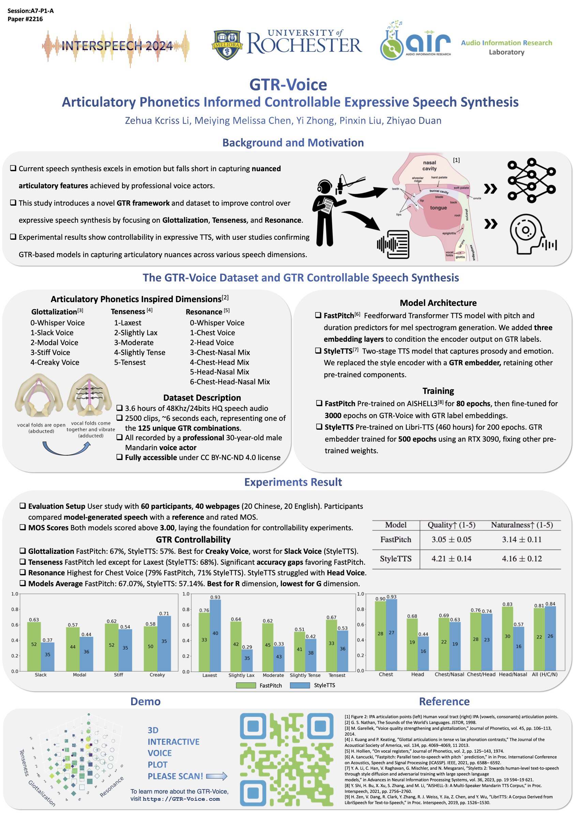

<p align="center">

  <h2 align="center">[Interspeech'24] GTR-Voice: Articulatory Phonetics Informed Controllable Expressive Speech Synthesis </h2>
  <p align="center">
    <strong>Zehua Kcriss Li</strong></a><sup>1</sup>
    · 
    <strong>Meiying Melissa Chen</strong></a><sup>1</sup>
    · 
    <strong>Yi Zhong</strong></a><sup>1</sup>
    ·
    <strong>Pinxin Liu</strong></a><sup>2</sup>
    ·
    <strong>Zhiyao Duan</strong></a><sup>1</sup>
    ·
    <br>
    <sup>1</sup>Department of Electrical and Computer Engineering, University of Rochester; 
    <br>
    <sup>2</sup>Department of Computer Science, University of Rochester
    <br>
    </br>
        <a href="https://arxiv.org/pdf/2406.10514v1">
        </a> &nbsp; &nbsp; 
        <a href='https://demo.gtr-voice.com/'>
        </a> &nbsp;&nbsp;

  </p>
    </p>
<div align="center">
  </a>
</div>

## 🗒 TODOs
- [x] Release the Dataset.
- [x] Build the Github Page.
- [ ] Release pretrained weights.
- [ ] Release training code.

## ⚒️ Environment
We recommend a python version ```>=3.9``` and cuda version ```=11.8```. It's possible to have other compatible version.

```bash
conda create -n gtr python=3.10
conda activate gtr
conda install pytorch==2.1.2 torchvision==0.16.2 torchaudio==2.1.2 pytorch-cuda=11.8 -c pytorch -c nvidia
pip install -r requirements.txt
```

Now, get started with the following code:

```bash
cd inference
CUDA_VISIBLE_DEVICES=0 python inference.py --wav_file ./assets/001.wav --init_frame ./assets/001.png
```

## 🔥 Train Your Own Model


### Train StyleTTS
Change into the ```styletts``` folder:

```bash
cd ../styletts
```

Run the following code to train StyleTTS stage 1

```bash

```

Run the following code to train StyleTTS stage 2
  
```bash

```


### Train PastPitch
Change into the ```image-warping``` folder:

```bash
cd fastpitch
```

Then run the following code to train fast-pitch:

```bash 

```


## 🙏 Acknowledgments

Our code follows several excellent repositories. We appreciate them for making their codes available to the public.
* [StyleTTS](https://github.com/yl4579/StyleTTS)
* [FastPitch](https://github.com/NVIDIA/DeepLearningExamples/tree/master/PyTorch/SpeechSynthesis/FastPitch)


## ✏️ Citing
If you find our work useful, please consider citing:
```BibTeX
@inproceedings{li2024gtr,
  title={GTR-Voice: Articulatory Phonetics Informed Controllable Expressive Speech Synthesis},
  author={Li, Zehua Kcriss and Chen, Meiying Melissa and Zhong, Yi and Liu, Pinxin and Duan, Zhiyao},
  booktitle={Proc. Interspeech 2024},
  pages={1775--1779},
  year={2024}
}
```


